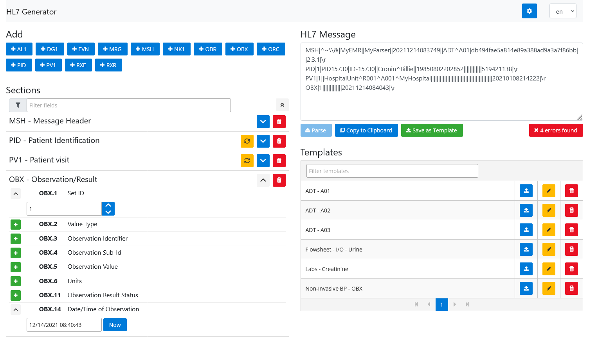

# HL7 Generator

If you had to read or write HL7 messages before, you know that it ain't exactly the most intuitive and
easy to understand message format... That's how this project was born.

**HL7 Generator** is a tool that helps manipulate HL7 messages, making it easy to parse, understand and
edit messages. It's Open Source, lightweight and doesn't require installation.  
Check the latest release [here](https://github.com/mghextreme/hl7-generator/releases).

## Features

Some of the main features are:

- Parse messages
- Support for multiple segments
  - Currently supports `AL1`, `DG1`, `EVN`, `MRG`, `MSH`, `NK1`, `OBX`, `OBR`, `PID`, `PV1`, `RXE`, `RXR`
  - **Important:** Not all fields are supported within the segments
- Generate data for segments and/or fields
- Search for fields
- Save and load template messages
- Message validation
  - Such as required fields, minimum and maximum field length, required section
- Internationalization support
  - Currently only `en` and `pt`
- Default value and timezone configuration

### Roadmap

The main goal for the application is facilitating the manipulation of HL7.
Heaving that in mind, some users have already given some feedback on new features that could improve
the usability of the tool. Some of them are listed below:

- Send messages to a REST endpoint
- More configurable fields
- Export/Import configuration
- Support for more segments / fields
- Improve validation

## Development setup

This project doesn't require a main server or back-end to run, everything required it's done in the
browser front-end.  
It uses [Angular 9](https://angular.io/) for the front-end, [PrimeNG](https://primefaces.org/primeng/)
for components and [Bootstrap](https://getbootstrap.com/) for UI and layout.

### Install packages

To run it locally, run `npm install` to install any required packages.

#### Rust Cargo and Tauri

If you wish to deploy it as an application, you must install [Rust Cargo](https://win.rustup.rs/x86_64)
and [Tauri](https://tauri.studio/en/docs/usage/development/integration#alternatively-install-tauri-cli-as-a-cargo-subcommand).

### Development server

Run `npm start` for a dev server. Navigate to [localhost:4200](http://localhost:4200/). The app will
automatically reload if you change any of the source files.

### Build

Run `npm run build` to build the project. The build artifacts will be stored in the `public/` directory.
Use the `--prod` flag for a production build.

### Creating .exe file

> Ensure you have installed [Rust Cargo and Tauri](#rust-cargo-and-tauri) before continuing.

After having generated the build artifacts in the `public/` folder, run `cargo tauri build` to create
an `.exe` file in the `src-tauri/target/release/` folder and an installer in the `bundle/` folder within the previous.
